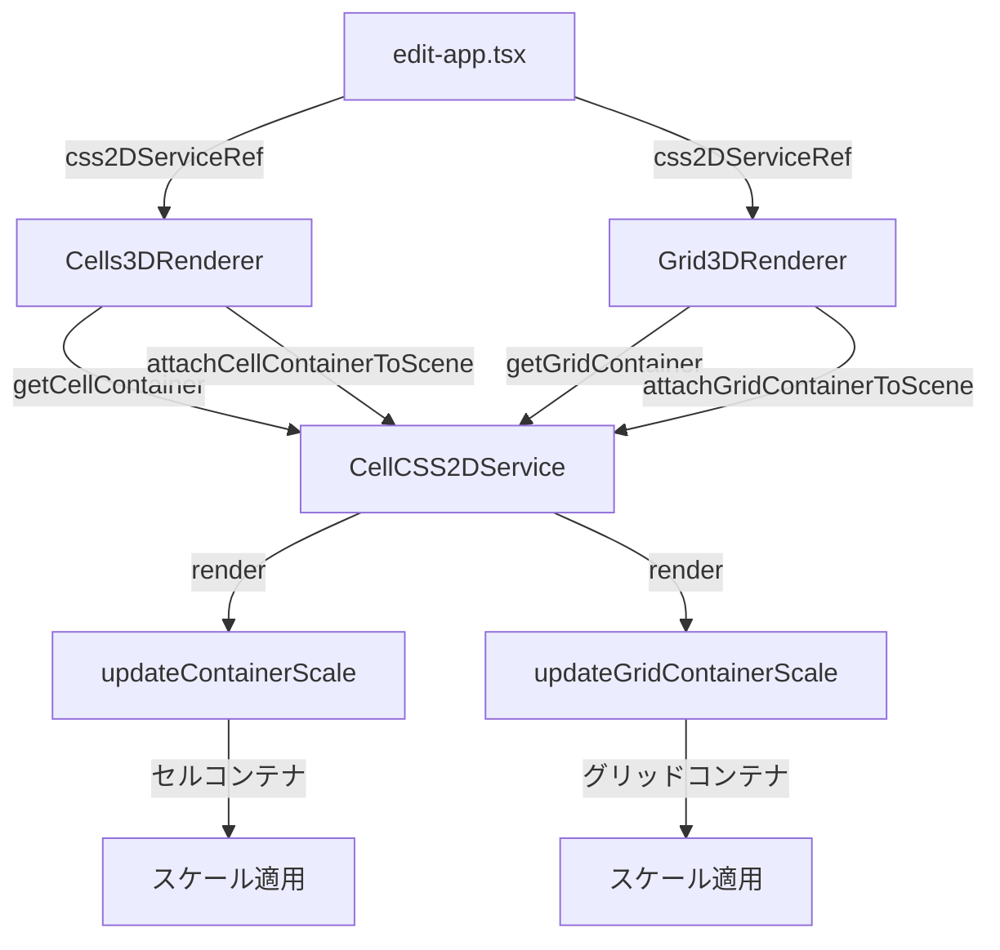

#CellCSS2DServiceに複数コンテナ管理機能を追加

## 変更の概要

`CellCSS2DService`にグリッドコンテナ管理機能を追加し、`Grid3DRenderer`が独自に管理しているコンテナとCSS2DObjectを`CellCSS2DService`経由で管理するように変更します。これにより、セルコンテナとグリッドコンテナの両方のスケール計算を統一し、BackcastPro-Steamの実装パターンに合わせます。

## 実装の詳細

### 1. CellCSS2DServiceの変更

[backcast/src/core/three/cell-css2d-service.ts](backcast/src/core/three/cell-css2d-service.ts) に以下を追加：

#### 1.1 グリッドコンテナ関連のプロパティを追加

```typescript
private gridContainer?: HTMLDivElement;
private gridCSS2DObject?: CSS2DObject;
private isGridContainerVisible = true;
```


#### 1.2 グリッドコンテナ作成メソッドを追加

- `createGridContainer()`: グリッドコンテナDOM要素を作成
- `.grid-3d-container`クラスを持つdiv要素を作成
- スタイル設定（position: absolute、pointer-events: noneなど）
- 子要素のpointer-eventsを有効化するスタイルを追加
- `createCellContainer()`と同様のパターンで実装

#### 1.3 グリッドコンテナ取得メソッドを追加

- `getGridContainer()`: グリッドコンテナを取得
- コンテナが存在しない場合は作成してから返す

#### 1.4 グリッドコンテナをシーンにアタッチするメソッドを追加

- `attachGridContainerToScene(scene: THREE.Scene, position: THREE.Vector3 = new THREE.Vector3(0, 0, 0))`: グリッドコンテナを3D空間に配置
- 既存のCSS2DObjectを削除してから新しいオブジェクトを作成
- `attachCellContainerToScene()`と同様のパターンで実装
- デフォルト位置は`(0, 0, 0)`

#### 1.5 グリッドコンテナのCSS2DObject取得メソッドを追加

- `getGridCSS2DObject()`: グリッドコンテナのCSS2DObjectを取得

#### 1.6 グリッドコンテナの位置取得メソッドを追加

- `getGridContainerPosition()`: グリッドコンテナの3D位置を取得

#### 1.7 グリッドコンテナのスケール更新メソッドを追加

- `updateGridContainerScale(camera: THREE.PerspectiveCamera)`: グリッドコンテナのスケールを更新
- `updateContainerScale()`と同様のロジック
- カメラ距離に基づくスケール計算を適用

#### 1.8 render()メソッドを更新

- `render()`メソッド内で`updateGridContainerScale()`も呼び出す
- セルコンテナとグリッドコンテナの両方のスケールを更新

#### 1.9 表示/非表示メソッドを追加

- `hideGridContainer()`: グリッドコンテナを非表示
- `showGridContainer()`: グリッドコンテナを表示
- `applyContainerVisibility()`を更新して、グリッドコンテナの表示状態も反映

#### 1.10 dispose()メソッドを更新

- グリッドコンテナとグリッドCSS2DObjectのクリーンアップ処理を追加
- CSS2DObjectをシーンから削除
- コンテナ内の子要素を削除
- コンテナ自体を削除

### 2. Grid3DRendererの変更

[backcast/src/components/editor/renderers/grid-3d-renderer.tsx](backcast/src/components/editor/renderers/grid-3d-renderer.tsx) を変更：

#### 2.1 独自のコンテナ作成処理を削除

- `useEffect`で独自にコンテナを作成している処理（47-73行目）を削除
- `gridContainer`のstateを削除

#### 2.2 CellCSS2DServiceからコンテナを取得

- `useEffect`で`css2DService.getGridContainer()`からコンテナを取得
- コンテナが取得できない場合は`null`を返す

#### 2.3 コンテナをシーンにアタッチする処理を変更

- 独自にCSS2DObjectを作成してシーンに追加している処理（76-111行目）を削除
- `css2DService.attachGridContainerToScene(scene, new THREE.Vector3(0, 0, 0))`を呼び出す
- 既にアタッチされている場合はスキップ（`css2DService.getGridCSS2DObject()`で確認）

#### 2.4 クリーンアップ処理を削除

- 独自のCSS2DObjectのクリーンアップ処理を削除
- `CellCSS2DService.dispose()`で自動的にクリーンアップされるため

#### 2.5 gridCSS2DObjectRefを削除

- `gridCSS2DObjectRef`は不要になるため削除

## 実装の流れ




## 注意点

1. **コンテナの初期化順序**: `CellCSS2DService.initializeRenderer()`が呼ばれた後に、各レンダラーがコンテナを取得・アタッチする
2. **スケール計算の統一**: 両方のコンテナに同じスケール計算ロジックを適用
3. **クリーンアップ**: `dispose()`で両方のコンテナを適切にクリーンアップ
4. **既存機能の維持**: セルコンテナ関連の既存機能は変更しない

## テスト計画

以下の動作を確認：

1. `CellCSS2DService.getGridContainer()`が正しくコンテナを返すか