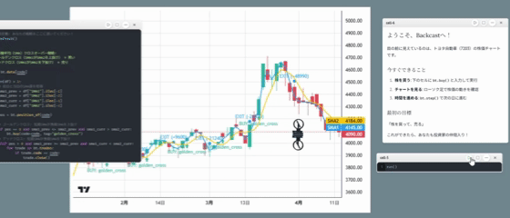

# Gameplay Guide

## The Interface

**Backcast** uses a modified version of the **Marimo** notebook interface. If you've used Jupyter or Python notebooks before, you'll feel right at home. If not, don't panic—it's just text and code.

### The Cell
The game is divided into "Cells".
- **Markdown Cells**: contain instructions, story elements, and hints.
- **Code Cells**: contain the Python code that controls your drones.

To execute a cell, press `Shift + Enter`.

## Drone Control API

Your primary tool is the `Drone` class. You will instantiate this in every level.

```python
from backcast.drone import Drone

# Initialize the drone swarm
swarm = Drone()

# Basic movement
swarm.move_forward(steps=1)
swarm.turn_left()
```

### Sensors
Drones can scan their surroundings to detect walls, resources, or enemies.

```python
if swarm.scan("forward") == "WALL":
    swarm.turn_right()
```

## The "Glitch"

The world of Backcast is unstable. You will encounter "Glitches"—areas where reality is corrupted.
To fix a Glitch, you must:
1.  **Analyze** the corrupted code block provided.
2.  **Debug** the logic error (e.g., infinite loops, off-by-one errors).
3.  **Run** the corrected code to stabilize the area.

<div align="center">
  
</div>

## Advanced Tactics

### Loops & Logic
You aren't limited to simple commands. Use Python's full power.

```python
# Clear a corridor
for _ in range(10):
    if swarm.scan("forward") == "CLEAR":
        swarm.move_forward()
    else:
        break
```

### The Time Paradox
(Unlocked in Chapter 3)
You can rewrite variables from *previous* cells to change the outcome of *future* events. This is the core of the Backcast Protocol.
