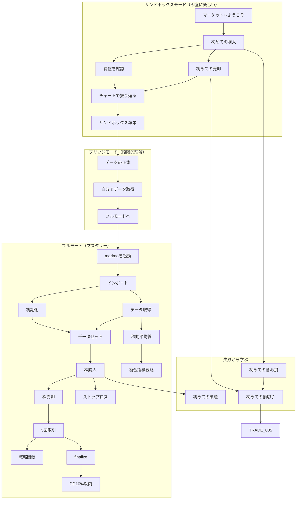

# Backcast スキルツリー

Backcastでは、スキルツリーシステムを通じてトレーディングを学びます。
58のスキルを達成しながら、バックテストの技術を習得していきましょう。

---

## 3トラック設計

```
[サンドボックス]      [ブリッジ]           [フルモード]
  即座に楽しい    →   段階的に理解    →    マスタリー
      |                    |                    |
 SANDBOX_001              |                    |
   ↓    ↓                 |                    |
SANDBOX_002  003          |                    |
   ↓    ↓                 |                    |
SANDBOX_004  005          |                    |
      ↓                   |                    |
 SANDBOX_006 ─────→ BRIDGE_001               |
                       ↓                      |
                  BRIDGE_002                  |
                       ↓                      |
                  BRIDGE_003 ──────────→ SETUP_001
                                         (既存47スキル)
```

| トラック | 目的 | スキル数 | 報酬合計 | 対象 |
|---------|------|---------|---------|------|
| サンドボックス | 即座にドーパミンを得る | 6 | 150,000円 | 全員（必須） |
| ブリッジ | 「なぜ動くか」を理解 | 3 | 60,000円 | サンドボックス卒業者 |
| フルモード | 自走できるようになる | 49 | 1,140,000円 | ブリッジ卒業者 |

---

## スキル一覧（全58スキル）

### サンドボックスカテゴリ（6スキル）

| ID | タイトル | 説明 | 前提条件 | 報酬 | 難易度 |
|----|---------|------|----------|------|--------|
| SANDBOX_001 | マーケットへようこそ | Backcastゲームを起動する | なし | +30,000円, 称号「初陣」 | ★ |
| SANDBOX_002 | 初めての購入 | `bt.buy()` で株を購入 | SANDBOX_001 | +20,000円 | ★ |
| SANDBOX_003 | 買値を確認する | 自分の買い注文の約定価格を確認 | SANDBOX_002 | +10,000円 | ★ |
| SANDBOX_004 | 初めての売却 | 保有株を売却する（損益問わず） | SANDBOX_002 | +20,000円 | ★ |
| SANDBOX_005 | チャートで振り返る | チャート上の売買マーカーを確認 | SANDBOX_003, SANDBOX_004 | +20,000円 | ★ |
| SANDBOX_006 | サンドボックス卒業 | 次のステージへ進む準備完了 | SANDBOX_005 | +50,000円, 機能: ブリッジモード | ★ |

**サンドボックス合計報酬: 150,000円**

### ブリッジカテゴリ（3スキル）

| ID | タイトル | 説明 | 前提条件 | 報酬 | 難易度 |
|----|---------|------|----------|------|--------|
| BRIDGE_001 | データの正体 | サンドボックスで使っていたデータの出所を確認 | SANDBOX_006 | +15,000円 | ★ |
| BRIDGE_002 | 自分でデータを取得 | `get_stock_daily()` をサンドボックス内で実行 | BRIDGE_001 | +20,000円, 銘柄: ソニー | ★ |
| BRIDGE_003 | フルモードへ | 新規ノートブックで0からセットアップ完了 | BRIDGE_002 | +25,000円, 機能: フルモード | ★★ |

**ブリッジ合計報酬: 60,000円**

### 失敗スキルカテゴリ（3スキル）

| ID | タイトル | 説明 | 前提条件 | 報酬 | 難易度 |
|----|---------|------|----------|------|--------|
| FAIL_001 | 初めての含み損 | 保有株が買値を下回る体験 | SANDBOX_002 | +5,000円, 称号「授業料」 | ★ |
| FAIL_002 | 初めての損切り | 損失を確定させる勇気 | SANDBOX_004, FAIL_001 | +10,000円, 称号「決断力」 | ★ |
| FAIL_003 | 初めての破産 | 資金が0以下になる | TRADE_001 | +20,000円, 称号「不死鳥への道」 | ★★ |

**失敗スキル合計報酬: 35,000円**

### セットアップカテゴリ（5スキル）

| ID | タイトル | 説明 | 前提条件 | 報酬 | 難易度 |
|----|---------|------|----------|------|--------|
| SETUP_001 | marimoを起動する | `marimo edit` でノートブックを開く | BRIDGE_003 | +10,000円 | ★ |
| SETUP_002 | BackcastProをインポート | `from BackcastPro import Backtest, get_stock_daily` | SETUP_001 | +10,000円 | ★ |
| SETUP_003 | Backtestを初期化する | `bt = Backtest(cash=1_000_000)` | SETUP_002 | +15,000円 | ★ |
| SETUP_004 | 初期資金を設定する | `cash` パラメータで初期資金を変更 | SETUP_003 | +7,500円 | ★ |
| SETUP_005 | 手数料を設定する | `commission` パラメータで手数料率を設定 | SETUP_003 | +7,500円 | ★ |

**セットアップ合計報酬: 50,000円**

### データ取得カテゴリ（6スキル）

| ID | タイトル | 説明 | 前提条件 | 報酬 | 難易度 |
|----|---------|------|----------|------|--------|
| DATA_001 | get_stock_dailyを使う | `get_stock_daily(code)` で株価データ取得 | SETUP_002 | +15,000円, 銘柄: トヨタ | ★ |
| DATA_002 | 株価データを確認する | 取得したDataFrameの中身を確認 | DATA_001 | +10,000円 | ★ |
| DATA_003 | OHLCV列を理解する | Open, High, Low, Close, Volume の意味を理解 | DATA_002 | +15,000円 | ★ |
| DATA_004 | 別の銘柄を取得する | トヨタ以外の銘柄コードでデータ取得 | DATA_001 | +15,000円, 銘柄: 日立 | ★ |
| DATA_005 | 複数銘柄を取得する | 2銘柄以上のデータを取得 | DATA_004 | +25,000円, 銘柄: 日経225 | ★★ |
| DATA_006 | 日付範囲を指定する | 特定期間のデータを取得 | DATA_001 | +20,000円 | ★★ |

**データ取得合計報酬: 100,000円**

### データセットカテゴリ（3スキル）

| ID | タイトル | 説明 | 前提条件 | 報酬 | 難易度 |
|----|---------|------|----------|------|--------|
| SET_001 | set_dataでデータをセット | `bt.set_data({code: df})` でデータを登録 | SETUP_003, DATA_001 | +30,000円, 機能: 取引解禁 | ★ |
| SET_002 | bt.dataでデータにアクセス | `bt.data[code]` で現在時点のデータを参照 | SET_001 | +15,000円 | ★ |
| SET_003 | 複数銘柄をセット | 2銘柄以上を同時にセット | SET_001, DATA_005 | +25,000円 | ★★ |

**データセット合計報酬: 70,000円**

### 基本取引カテゴリ（10スキル）

| ID | タイトル | 説明 | 前提条件 | 報酬 | 難易度 |
|----|---------|------|----------|------|--------|
| TRADE_001 | 株を購入する（フルモード） | フルモードで `bt.buy()` を実行 | SET_001 | +20,000円, 称号「投資家デビュー」 | ★ |
| TRADE_002 | ポジションを確認する | `bt.position` で確認 | TRADE_001 | +10,000円 | ★ |
| TRADE_003 | 株を売却する | `trade.close()` でポジションを決済 | TRADE_001 | +15,000円 | ★ |
| TRADE_004 | 利益確定する | 利益が出ている状態で売却 | TRADE_003 | +20,000円, 称号「利確マスター」 | ★ |
| TRADE_005 | 損切りする | 損失状態で売却を決断 | TRADE_003, FAIL_002 | +20,000円 | ★ |
| TRADE_006 | タグを活用する | `tag` 引数で売買理由を記録 | TRADE_001 | +10,000円 | ★ |
| TRADE_007 | 5回取引達成 | 合計5回の売買を完了 | TRADE_003 | +25,000円 | ★ |
| TRADE_008 | 戦略関数を作成する | `def my_strategy(bt):` で自作戦略を定義 | TRADE_007 | +40,000円, 機能: 戦略保存 | ★★ |
| TRADE_009 | bt.step()を理解する | ゲームループの1ステップを理解 | SET_001 | +20,000円 | ★ |
| TRADE_010 | run()でループ実行 | 手動step()との違いを理解 | TRADE_009 | +15,000円 | ★★ |

**基本取引合計報酬: 195,000円**

### チャートカテゴリ（4スキル）

| ID | タイトル | 説明 | 前提条件 | 報酬 | 難易度 |
|----|---------|------|----------|------|--------|
| CHART_001 | チャートを表示する | `bt.chart()` でローソク足チャートを表示 | SET_001 | +20,000円 | ★ |
| CHART_002 | 売買マーカーを確認する | チャート上の売買ポイントを確認 | CHART_001, TRADE_003 | +10,000円 | ★ |
| CHART_003 | インジケーターを表示する | `indicators` 引数で指標をオーバーレイ | CHART_001, IND_001 | +15,000円 | ★★ |
| CHART_004 | 複数インジケーターを表示 | 2つ以上の指標を同時表示 | CHART_003 | +20,000円 | ★★ |

**チャート合計報酬: 65,000円**

### インジケーターカテゴリ（9スキル）

| ID | タイトル | 説明 | 前提条件 | 報酬 | 難易度 |
|----|---------|------|----------|------|--------|
| IND_001 | 移動平均線を計算する | `df['SMA'] = df['Close'].rolling(N).mean()` | DATA_002 | +20,000円 | ★★ |
| IND_002 | SMAをDataFrameに追加 | 計算したSMAをDataFrameの列として追加 | IND_001 | +15,000円 | ★★ |
| IND_003 | ゴールデンクロスを検出 | 短期MAが長期MAを上抜け | IND_002 | +30,000円 | ★★★ |
| IND_004 | デッドクロスを検出 | 短期MAが長期MAを下抜け | IND_003 | +30,000円 | ★★★ |
| IND_005 | RSIを計算する | 相対力指数(14日)を計算 | IND_001 | +30,000円 | ★★★ |
| IND_006 | RSI過熱判定 | RSI>70で売り、RSI<30で買い | IND_005 | +35,000円 | ★★★ |
| IND_007 | ボリンジャーバンドを計算 | BB(20,2)を計算 | IND_001 | +35,000円 | ★★★ |
| IND_008 | 複合指標戦略 | 2つ以上の指標を組み合わせた戦略 | IND_003, IND_005 | +60,000円, 称号「テクニカル入門」 | ★★★ |
| IND_009 | MACDを計算する | MACD(12,26,9)を計算 | IND_001 | +35,000円 | ★★★ |

**インジケーター合計報酬: 290,000円**

### リスク管理カテゴリ（10スキル）

| ID | タイトル | 説明 | 前提条件 | 報酬 | 難易度 |
|----|---------|------|----------|------|--------|
| RISK_001 | ストップロスを設定する | `bt.buy(sl=価格)` でSL注文 | TRADE_001 | +25,000円, 機能: SL/TP注文 | ★★ |
| RISK_002 | テイクプロフィットを設定 | `bt.buy(tp=価格)` でTP注文 | RISK_001 | +25,000円 | ★★ |
| RISK_003 | SL/TPを併用する | 両方を同時に設定 | RISK_001, RISK_002 | +35,000円, 称号「プロの心得」 | ★★ |
| RISK_004 | リスクリワード1:2 | SL幅の2倍のTP幅で取引 | RISK_003 | +50,000円 | ★★★ |
| RISK_005 | finalize()で結果を確認 | バックテスト統計を確認 | TRADE_007 | +20,000円 | ★★ |
| RISK_006 | ドローダウンを確認する | Max Drawdown を確認 | RISK_005 | +20,000円 | ★★ |
| RISK_007 | DD20%以内を達成 | 最大ドローダウン20%以内 | RISK_006 | +50,000円 | ★★★ |
| RISK_008 | DD10%以内を達成 | 最大ドローダウン10%以内 | RISK_007 | +100,000円, 称号「堅実派」 | ★★★★ |
| RISK_009 | ポジションサイズを調整 | 資金の一部だけで取引 | TRADE_001 | +30,000円 | ★★ |
| RISK_010 | 勝率50%以上を達成 | 10取引以上で勝率50%超え | RISK_005 | +40,000円 | ★★★ |

**リスク管理合計報酬: 395,000円**

---

## ゲーム進行フロー

### 序盤（スキル1-12）- オンボーディング

| 順序 | スキル | 累計報酬 | 体験 |
|------|--------|---------|------|
| 1 | SANDBOX_001 | 30,000円 | 「ゲームに入った！」 |
| 2 | SANDBOX_002 | 50,000円 | 「株を買った！」 |
| 3 | SANDBOX_003 | 60,000円 | 「買値がわかった！」 |
| 4 | SANDBOX_004 | 80,000円 | 「売れた！」 |
| 5 | SANDBOX_005 | 100,000円 | 「取引履歴が見える！」 |
| 6 | SANDBOX_006 | 150,000円 | 「サンドボックス卒業！」 |
| 7 | BRIDGE_001 | 165,000円 | 「なるほど、こうなってたのか」 |
| 8 | BRIDGE_002 | 185,000円 | 「自分でもできた！」 |
| 9 | BRIDGE_003 | 210,000円 | 「フルモード解禁！」 |

### 中盤（スキル13-35）- 学習

- データ操作（DATA_001-006）: +100,000円
- データセット（SET_001-003）: +70,000円
- 取引基礎（TRADE_001-010）: +195,000円
- チャート（CHART_001-004）: +65,000円

### 終盤（スキル36-58）- マスタリー

- インジケーター（IND_001-009）: +290,000円
- リスク管理（RISK_001-010）: +395,000円

---

## マイルストーン報酬

| マイルストーン | スキル数 | ボーナス報酬 |
|--------------|---------|-------------|
| ブロンズ | 10 | +50,000円, 称号「見習い投資家」 |
| シルバー | 20 | +100,000円, 称号「新進トレーダー」 |
| ゴールド | 35 | +200,000円, 銘柄: 米国株ETF |
| プラチナ | 50 | +400,000円, 称号「Backcastエキスパート」 |
| マスター | 58 | +600,000円, 称号「マスター投資家」, 機能: 戦略テンプレート共有 |

**マイルストーン合計: 1,350,000円**

---

## 報酬サマリー

| カテゴリ | スキル数 | 報酬合計 | 平均/スキル |
|---------|---------|---------|------------|
| サンドボックス | 6 | 150,000円 | 25,000円 |
| ブリッジ | 3 | 60,000円 | 20,000円 |
| 失敗 | 3 | 35,000円 | 11,667円 |
| セットアップ | 5 | 50,000円 | 10,000円 |
| データ取得 | 6 | 100,000円 | 16,667円 |
| データセット | 3 | 70,000円 | 23,333円 |
| 基本取引 | 10 | 195,000円 | 19,500円 |
| チャート | 4 | 65,000円 | 16,250円 |
| インジケーター | 9 | 290,000円 | 32,222円 |
| リスク管理 | 10 | 395,000円 | 39,500円 |
| **合計** | **58** | **1,410,000円** | **24,310円** |

| 項目 | 金額 |
|------|------|
| スキル報酬 | 1,410,000円 |
| マイルストーン報酬 | 1,350,000円 |
| **総計** | **2,760,000円** |

---

## ソーシャル機能

### ランクシステム

| ランク | 条件 |
|--------|------|
| ブロンズ | 10スキル + 利益あり |
| シルバー | 20スキル + リターン+20% |
| ゴールド | 35スキル + シャープレシオ > 1.0 |
| プラチナ | 50スキル + DD < 15% |
| マスター | 58スキル + シャープレシオ > 2.0 + DD < 10% |

### 実績バッジ

| バッジ | 条件 | レア度 |
|--------|------|--------|
| スピードランナー | サンドボックスを5分以内に完了 | ★★ |
| トレードマシン | 累計1,000取引 | ★★ |
| パーフェクトウィーク | 7日連続勝利 | ★★★ |
| フェニックス | 破産から復活して利益 | ★★★★ |
| ワンショットワンダー | 1取引で+50% | ★★★★ |
| コンプリーティスト | 全58スキル達成 | ★★★★★ |
| **隠しバッジ** | ??? | ★★★★★ |

---

## スキルツリー依存関係図


