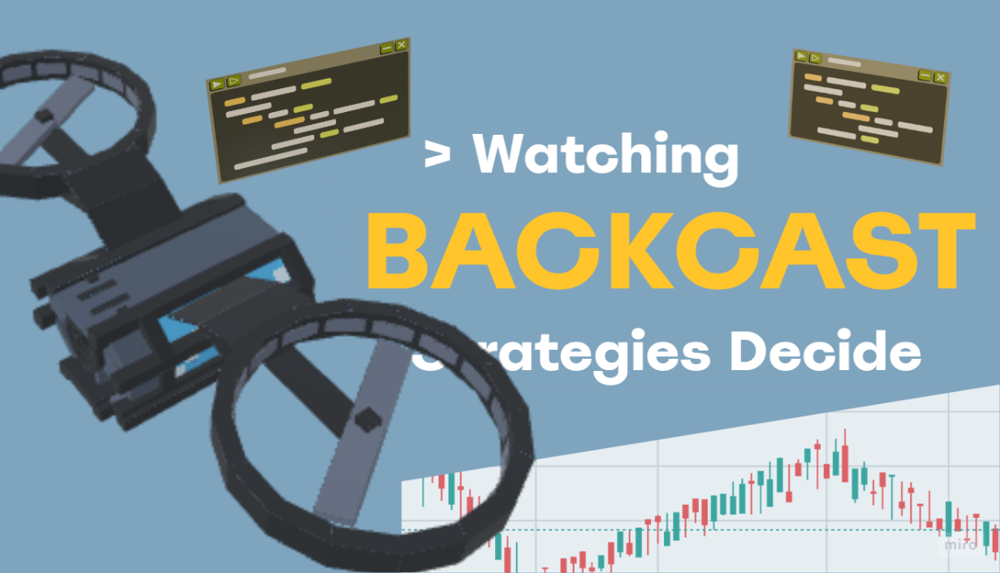
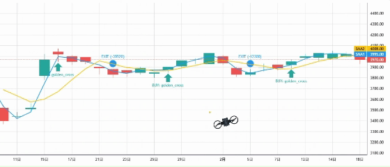

# BackcastPro

  

!!! quote ""
    **"The only way forward is to rewrite the past."**

**BackcastPro** is a puzzle-automation game where **Python code** is your only weapon. Use a fully integrated coding environment to control drones, hack security systems, and solve complex logic puzzles.

  

## 🎮 Game Features

### 🐍 Real Code, Real Consequences
Forget pseudo-code. In **BackcastPro**, you write actual **Python**. The game runs on a sandboxed `marimo` kernel, meaning your scripts have real power—and real risks.

### 🤖 Automate & Dominate
Program your **Drone Swarm** to navigate hazardous mazes. Write efficient algorithms to optimize pathfinding and resource gathering.

  

### 🧩 Logic is Key
From simple sequence puzzles to complex recursion challenges, your problem-solving skills will be tested.

---

-   :material-controller: **Gameplay Guide**
    ---
    Learn the basics of the interface and drone control APIs.
    [:arrow_right: Start Coding](game-guide.md)

-   :material-book-open-page-variant: **Lore & Story**
    ---
    Uncover the mystery behind the *Backcast* protocol.
    [:arrow_right: Read Archives](story.md)

-   :material-security: **Security Policy**
    ---
    Understand how our sandboxed Python environment protects your PC.
    [:arrow_right: Safety First](steam-security-policy.md)

-   :material-help-circle: **FAQ**
    ---
    Cloud saves, achievements, and troubleshooting.
    [:arrow_right: Get Help](faq.md)

 

  <a href="https://store.steampowered.com/app/YOUR_APP_ID" class="md-button md-button--primary">Available on Steam</a>

