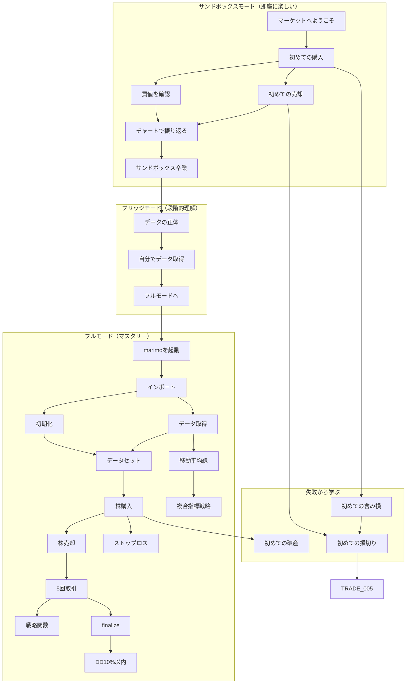

# Backcast スキルツリー企画書 v4

**バージョン**: v1.0
**作成日**: 2026-02-02
**ステータス**: ✅ 完了（phase6一部・phase8スキップ）

---

## 1. 概要

### 1.1 ゲームコンセプト

「Backcast」は、BackcastProを使ったリプレイ型トレーディングシミュレーターです。
プレイヤーは株価データを取得し、自動売買戦略をプログラミングして高得点を目指します。

**コミュニティ重視**: Steamのような「ユーザー同士が成績を自慢し合う文化」を醸成。

### 1.2 v4の主な変更点（v3からの改善）

| 項目 | v3 | v4 | 改善理由 |
|------|-----|-----|---------|
| スキル総数 | 52 | **58** | ブリッジ3 + 失敗3スキル追加 |
| 報酬曲線 | フロントローディング | **成長曲線型** | 後半モチベーション維持 |
| サンドボックス報酬 | 230,000円 | **150,000円** | 報酬インフレ抑制 |
| トラック構造 | 2トラック | **3トラック** | ブリッジトラック追加 |
| SANDBOX_004条件 | 利益必須 | **売却完了** | 運要素の排除 |
| 失敗スキル | なし | **3スキル** | 教育効果向上 |

---

## 2. 3トラック設計（v4の核心）

### 2.1 構造

```
[サンドボックス]      [ブリッジ]           [フルモード]
  即座に楽しい    →   段階的に理解    →    マスタリー
      |                    |                    |
 SANDBOX_001              |                    |
   ↓    ↓                 |                    |
SANDBOX_002  003          |                    |
   ↓    ↓                 |                    |
SANDBOX_004  005          |                    |
      ↓                   |                    |
 SANDBOX_006 ─────→ BRIDGE_001               |
                       ↓                      |
                  BRIDGE_002                  |
                       ↓                      |
                  BRIDGE_003 ──────────→ SETUP_001
                                         (既存47スキル)
```

### 2.2 トラックの役割

| トラック | 目的 | スキル数 | 報酬合計 | 対象 |
|---------|------|---------|---------|------|
| サンドボックス | 即座にドーパミンを得る | 6 | 150,000円 | 全員（必須） |
| ブリッジ | 「なぜ動くか」を理解 | 3 | 60,000円 | サンドボックス卒業者 |
| フルモード | 自走できるようになる | 49 | 1,140,000円 | ブリッジ卒業者 |

---

## 3. 報酬設計（成長曲線型）

### 3.1 v3 vs v4 報酬比較

| 区間 | スキル数 | v3報酬 | v4報酬 | 変化 |
|------|---------|--------|--------|------|
| サンドボックス | 5→6 | 230,000円 | 150,000円 | -35% |
| ブリッジ | 0→3 | - | 60,000円 | 新規 |
| セットアップ | 5 | 30,000円 | 50,000円 | +67% |
| 中盤(DATA〜TRADE) | 22 | 340,000円 | 450,000円 | +32% |
| 終盤(IND〜RISK) | 19 | 530,000円 | 640,000円 | +21% |
| 失敗スキル | 0→3 | - | 35,000円 | 新規 |

### 3.2 報酬曲線のコンセプト

```
報酬/スキル
    ^
    |                              ★ マスタリー
    |                           ★
    |                        ★
    |                     ★
    |                  ★          ← 成長曲線型（v4）
    |               ★
    |            ★
    |         ★
    |  ★ ★ ★                      ← フロントローディング（v3）
    +---------------------------------> スキル進行度
       序盤      中盤        終盤
```

**設計思想**: 序盤は「簡単に達成できる喜び」、終盤は「大きな報酬を得る達成感」

---

## 4. スキル一覧（全58スキル）

### 4.1 サンドボックスカテゴリ（6スキル）

| ID | タイトル | 説明 | 前提条件 | 報酬 | 難易度 |
|----|---------|------|----------|------|--------|
| SANDBOX_001 | マーケットへようこそ | Backcastゲームを起動する | なし | +30,000円, 称号「初陣」 | ★ |
| SANDBOX_002 | 初めての購入 | `bt.buy()` で株を購入 | SANDBOX_001 | +20,000円 | ★ |
| SANDBOX_003 | 買値を確認する | 自分の買い注文の約定価格を確認 | SANDBOX_002 | +10,000円 | ★ |
| SANDBOX_004 | 初めての売却 | 保有株を売却する（損益問わず） | SANDBOX_002 | +20,000円 | ★ |
| SANDBOX_005 | チャートで振り返る | チャート上の売買マーカーを確認 | SANDBOX_003, SANDBOX_004 | +20,000円 | ★ |
| SANDBOX_006 | サンドボックス卒業 | 次のステージへ進む準備完了 | SANDBOX_005 | +50,000円, 機能: ブリッジモード | ★ |

**サンドボックス合計報酬: 150,000円**（v3の230,000円から-35%）

#### SANDBOX_001: マーケットへようこそ

**達成条件**: ゲームを起動してチャートを確認

**helpContent**:
```markdown
## ようこそ、Backcastへ！

目の前に見えているのは、トヨタ自動車（7203）の株価チャートです。

### 今すぐできること

1. **株を買う**: 下のセルに `bt.buy()` と入力して実行
2. **チャートを見る**: ローソク足で株価の動きを確認
3. **時間を進める**: `bt.step()` で次の日に進む

### 最初の目標

「株を買って、売る」

これができたら、あなたも投資家の仲間入り！
```

#### SANDBOX_003: 買値を確認する（v4で変更）

**達成条件**: `bt.trades` で自分の取引を確認する

**helpContent**:
```markdown
## 買った株を確認しよう

買い注文を出したら、いくらで買えたか確認しましょう。

```python
# 保有中の取引を確認
for trade in bt.trades:
    print(f"銘柄: {trade.code}")
    print(f"買値: {trade.entry_price:,.0f}円")
    print(f"株数: {trade.size}株")
```

### ポイント

- `trade.entry_price` が買った時の価格
- `trade.size` が保有株数
- この情報は売却タイミングを決めるのに重要！
```

#### SANDBOX_004: 初めての売却（v4で変更）

**達成条件**: `trade.close()` でポジションを決済する（損益問わず）

**helpContent**:
```markdown
## 株を売ってみよう

買った株を売却してみましょう。利益が出ても損失が出ても大丈夫！

```python
# 保有株を売却
for trade in bt.trades:
    trade.close()
    print("売却完了！")
```

### ポイント

- 利益が出ていなくても売却は重要な経験
- 「損切り」はプロトレーダーの基本スキル
- 次のステップで利益を狙う方法を学びます
```

---

### 4.2 ブリッジカテゴリ（新規3スキル）

| ID | タイトル | 説明 | 前提条件 | 報酬 | 難易度 |
|----|---------|------|----------|------|--------|
| BRIDGE_001 | データの正体 | サンドボックスで使っていたデータの出所を確認 | SANDBOX_006 | +15,000円 | ★ |
| BRIDGE_002 | 自分でデータを取得 | `get_stock_daily()` をサンドボックス内で実行 | BRIDGE_001 | +20,000円, 銘柄: ソニー | ★ |
| BRIDGE_003 | フルモードへ | 新規ノートブックで0からセットアップ完了 | BRIDGE_002 | +25,000円, 機能: フルモード | ★★ |

**ブリッジ合計報酬: 60,000円**

#### BRIDGE_001: データの正体

**達成条件**: サンドボックスのデータソースを確認

**helpContent**:
```markdown
## サンドボックスの「魔法」を解き明かす

サンドボックスでは、最初から株を買えましたよね？
でも実は、裏でこんなコードが動いていました：

```python
# サンドボックスの裏側（自動実行されていた）
from BackcastPro import Backcast, get_stock_daily

bt = Backtest(cash=100_000)
df = get_stock_daily("7203")  # ← これでトヨタのデータを取得
bt.set_data({"7203": df})     # ← これでデータをセット

# ここまで完了した状態で、あなたに渡されていた
```

### 確認してみよう

```python
# 現在セットされているデータを確認
print(bt._data.keys())  # → dict_keys(['7203'])
print(len(bt._data["7203"]))  # → データの行数
```

### 気づき

- `get_stock_daily()` で株価データを取得
- `set_data()` でBacktestに登録
- これがないと `buy()` は使えない！
```

#### BRIDGE_002: 自分でデータを取得

**達成条件**: サンドボックス内で `get_stock_daily()` を実行

**helpContent**:
```markdown
## 別の銘柄を追加してみよう

サンドボックスにはトヨタしかありません。
ソニー（6758）を追加してみましょう！

```python
# ソニーのデータを取得
df_sony = get_stock_daily("6758")

# 中身を確認
print(df_sony.head())
print(f"データ期間: {df_sony.index[0]} 〜 {df_sony.index[-1]}")
```

### 次のステップ

取得したデータを `set_data()` でセットする方法は、
フルモードで学びます。

今は「データを自分で取得できる」ことを体験してください！
```

#### BRIDGE_003: フルモードへ

**達成条件**: 新規ノートブックで `Backtest()` → `get_stock_daily()` → `set_data()` → `buy()` を完了

**helpContent**:
```markdown
## ついにフルモードへ！

サンドボックスで学んだことを活かして、
0から自分でセットアップしてみましょう。

### 手順

```python
# 1. インポート
from BackcastPro import Backtest, get_stock_daily

# 2. Backtest初期化（好きな金額で！）
bt = Backtest(cash=1_000_000)

# 3. 株価データ取得
code = "7203"
df = get_stock_daily(code)

# 4. データをセット
bt.set_data({code: df})

# 5. これでサンドボックスと同じ状態！
bt.buy()  # 買える！
```

### おめでとうございます！

これでBackcastの基本をマスターしました。
フルモードでは、さらに高度な機能が解禁されます：

- 複数銘柄の同時運用
- インジケーター（移動平均線、RSIなど）
- リスク管理（ストップロス、テイクプロフィット）
```

---

### 4.3 失敗スキルカテゴリ（新規3スキル）

| ID | タイトル | 説明 | 前提条件 | 報酬 | 難易度 |
|----|---------|------|----------|------|--------|
| FAIL_001 | 初めての含み損 | 保有株が買値を下回る体験 | SANDBOX_002 | +5,000円, 称号「授業料」 | ★ |
| FAIL_002 | 初めての損切り | 損失を確定させる勇気 | SANDBOX_004, FAIL_001 | +10,000円, 称号「決断力」 | ★ |
| FAIL_003 | 初めての破産 | 資金が0以下になる | TRADE_001 | +20,000円, 称号「不死鳥への道」 | ★★ |

**失敗スキル合計報酬: 35,000円**

#### FAIL_001: 初めての含み損

**達成条件**: `trade.pl < 0` の状態を経験

**helpContent**:
```markdown
## 含み損は「勉強代」

買った株が値下がりすることは珍しくありません。
これは失敗ではなく、投資の現実を学ぶ第一歩です。

```python
# 含み損益を確認
for trade in bt.trades:
    if trade.pl < 0:
        print(f"含み損: {trade.pl:,.0f}円 ({trade.pl_pct:.1f}%)")
```

### プロの考え方

- 100%勝てる投資家は存在しない
- 重要なのは「トータルでプラス」になること
- 小さな損失を受け入れ、大きな利益を狙う

> 「損小利大」がプロの鉄則
```

#### FAIL_002: 初めての損切り

**達成条件**: 含み損状態で `trade.close()` を実行

**helpContent**:
```markdown
## 損切りはプロの証

損切り（ロスカット）は、損失を最小限に抑えるための重要な技術です。

```python
# 損切りの実行
for trade in bt.trades:
    if trade.pl < 0 and trade.pl_pct < -5:  # 5%以上の損失
        trade.close()
        print("損切り完了 - これ以上の損失を防いだ！")
```

### なぜ損切りが重要？

| 含み損 | 回復に必要な利益率 |
|--------|-------------------|
| -10% | +11.1% |
| -20% | +25.0% |
| -50% | +100.0% |
| -90% | +900.0% |

損失が大きくなるほど、回復が困難になります。
早めの損切りが資金を守る！
```

#### FAIL_003: 初めての破産

**達成条件**: `bt.equity <= 0` になる

**helpContent**:
```markdown
## 破産を経験しました

おめでとうございます...？いえ、これも大切な経験です。

### 破産の原因を分析

```python
# 取引履歴を確認
for trade in bt.closed_trades:
    print(f"{trade.code}: {trade.pl:+,.0f}円")
```

### よくある破産パターン

1. **全力買い**: 1銘柄に全資金を投入
2. **損切りなし**: 含み損を放置して拡大
3. **ナンピン地獄**: 下がるたびに買い増し

### 次回への教訓

- ポジションサイズを管理する（全力買いしない）
- ストップロスを設定する
- 1回の取引で失っていい金額を決める

> 「マーケットは授業料を取る。問題は、その授業料で何を学ぶかだ」
```

---

### 4.4 セットアップカテゴリ（5スキル）

| ID | タイトル | 説明 | 前提条件 | 報酬 | 難易度 |
|----|---------|------|----------|------|--------|
| SETUP_001 | marimoを起動する | `marimo edit` でノートブックを開く | BRIDGE_003 | +10,000円 | ★ |
| SETUP_002 | BackcastProをインポート | `from BackcastPro import Backtest, get_stock_daily` | SETUP_001 | +10,000円 | ★ |
| SETUP_003 | Backtestを初期化する | `bt = Backtest(cash=1_000_000)` | SETUP_002 | +15,000円 | ★ |
| SETUP_004 | 初期資金を設定する | `cash` パラメータで初期資金を変更 | SETUP_003 | +7,500円 | ★ |
| SETUP_005 | 手数料を設定する | `commission` パラメータで手数料率を設定 | SETUP_003 | +7,500円 | ★ |

**セットアップ合計報酬: 50,000円**（v3の30,000円から+67%）

---

### 4.5 データ取得カテゴリ（6スキル）

| ID | タイトル | 説明 | 前提条件 | 報酬 | 難易度 |
|----|---------|------|----------|------|--------|
| DATA_001 | get_stock_dailyを使う | `get_stock_daily(code)` で株価データ取得 | SETUP_002 | +15,000円, 銘柄: トヨタ | ★ |
| DATA_002 | 株価データを確認する | 取得したDataFrameの中身を確認 | DATA_001 | +10,000円 | ★ |
| DATA_003 | OHLCV列を理解する | Open, High, Low, Close, Volume の意味を理解 | DATA_002 | +15,000円 | ★ |
| DATA_004 | 別の銘柄を取得する | トヨタ以外の銘柄コードでデータ取得 | DATA_001 | +15,000円, 銘柄: 日立 | ★ |
| DATA_005 | 複数銘柄を取得する | 2銘柄以上のデータを取得 | DATA_004 | +25,000円, 銘柄: 日経225 | ★★ |
| DATA_006 | 日付範囲を指定する | 特定期間のデータを取得 | DATA_001 | +20,000円 | ★★ |

**データ取得合計報酬: 100,000円**（v3の75,000円から+33%）

---

### 4.6 データセットカテゴリ（3スキル）

| ID | タイトル | 説明 | 前提条件 | 報酬 | 難易度 |
|----|---------|------|----------|------|--------|
| SET_001 | set_dataでデータをセット | `bt.set_data({code: df})` でデータを登録 | SETUP_003, DATA_001 | +30,000円, 機能: 取引解禁 | ★ |
| SET_002 | bt.dataでデータにアクセス | `bt.data[code]` で現在時点のデータを参照 | SET_001 | +15,000円 | ★ |
| SET_003 | 複数銘柄をセット | 2銘柄以上を同時にセット | SET_001, DATA_005 | +25,000円 | ★★ |

**データセット合計報酬: 70,000円**（v3の55,000円から+27%）

---

### 4.7 基本取引カテゴリ（10スキル）

| ID | タイトル | 説明 | 前提条件 | 報酬 | 難易度 |
|----|---------|------|----------|------|--------|
| TRADE_001 | 株を購入する（フルモード） | フルモードで `bt.buy()` を実行 | SET_001 | +20,000円, 称号「投資家デビュー」 | ★ |
| TRADE_002 | ポジションを確認する | `bt.position` または `bt.position_of(code)` で確認 | TRADE_001 | +10,000円 | ★ |
| TRADE_003 | 株を売却する | `trade.close()` でポジションを決済 | TRADE_001 | +15,000円 | ★ |
| TRADE_004 | 利益確定する | 利益が出ている状態で売却 | TRADE_003 | +20,000円, 称号「利確マスター」 | ★ |
| TRADE_005 | 損切りする | 損失状態で売却を決断 | TRADE_003, FAIL_002 | +20,000円 | ★ |
| TRADE_006 | タグを活用する | `tag` 引数で売買理由を記録 | TRADE_001 | +10,000円 | ★ |
| TRADE_007 | 5回取引達成 | 合計5回の売買を完了 | TRADE_003 | +25,000円 | ★ |
| TRADE_008 | 戦略関数を作成する | `def my_strategy(bt):` で自作戦略を定義 | TRADE_007 | +40,000円, 機能: 戦略保存 | ★★ |
| TRADE_009 | bt.step()を理解する | ゲームループの1ステップを理解 | SET_001 | +20,000円 | ★ |
| TRADE_010 | run()でループ実行 | 手動step()との違いを理解 | TRADE_009 | +15,000円 | ★★ |

**基本取引合計報酬: 195,000円**（v3の140,000円から+39%）

---

### 4.8 チャートカテゴリ（4スキル）

| ID | タイトル | 説明 | 前提条件 | 報酬 | 難易度 |
|----|---------|------|----------|------|--------|
| CHART_001 | チャートを表示する | `bt.chart()` でローソク足チャートを表示 | SET_001 | +20,000円 | ★ |
| CHART_002 | 売買マーカーを確認する | チャート上の売買ポイントを確認 | CHART_001, TRADE_003 | +10,000円 | ★ |
| CHART_003 | インジケーターを表示する | `indicators` 引数で指標をオーバーレイ | CHART_001, IND_001 | +15,000円 | ★★ |
| CHART_004 | 複数インジケーターを表示 | 2つ以上の指標を同時表示 | CHART_003 | +20,000円 | ★★ |

**チャート合計報酬: 65,000円**（v3の45,000円から+44%）

---

### 4.9 インジケーターカテゴリ（9スキル）

| ID | タイトル | 説明 | 前提条件 | 報酬 | 難易度 |
|----|---------|------|----------|------|--------|
| IND_001 | 移動平均線を計算する | `df['SMA'] = df['Close'].rolling(N).mean()` | DATA_002 | +20,000円 | ★★ |
| IND_002 | SMAをDataFrameに追加 | 計算したSMAをDataFrameの列として追加 | IND_001 | +15,000円 | ★★ |
| IND_003 | ゴールデンクロスを検出 | 短期MAが長期MAを上抜け | IND_002 | +30,000円 | ★★★ |
| IND_004 | デッドクロスを検出 | 短期MAが長期MAを下抜け | IND_003 | +30,000円 | ★★★ |
| IND_005 | RSIを計算する | 相対力指数(14日)を計算 | IND_001 | +30,000円 | ★★★ |
| IND_006 | RSI過熱判定 | RSI>70で売り、RSI<30で買い | IND_005 | +35,000円 | ★★★ |
| IND_007 | ボリンジャーバンドを計算 | BB(20,2)を計算 | IND_001 | +35,000円 | ★★★ |
| IND_008 | 複合指標戦略 | 2つ以上の指標を組み合わせた戦略 | IND_003, IND_005 | +60,000円, 称号「テクニカル入門」 | ★★★ |
| IND_009 | MACDを計算する | MACD(12,26,9)を計算 | IND_001 | +35,000円 | ★★★ |

**インジケーター合計報酬: 290,000円**（v3の240,000円から+21%）

---

### 4.10 リスク管理カテゴリ（10スキル）

| ID | タイトル | 説明 | 前提条件 | 報酬 | 難易度 |
|----|---------|------|----------|------|--------|
| RISK_001 | ストップロスを設定する | `bt.buy(sl=価格)` でSL注文 | TRADE_001 | +25,000円, 機能: SL/TP注文 | ★★ |
| RISK_002 | テイクプロフィットを設定 | `bt.buy(tp=価格)` でTP注文 | RISK_001 | +25,000円 | ★★ |
| RISK_003 | SL/TPを併用する | 両方を同時に設定 | RISK_001, RISK_002 | +35,000円, 称号「プロの心得」 | ★★ |
| RISK_004 | リスクリワード1:2 | SL幅の2倍のTP幅で取引 | RISK_003 | +50,000円 | ★★★ |
| RISK_005 | finalize()で結果を確認 | バックテスト統計を確認 | TRADE_007 | +20,000円 | ★★ |
| RISK_006 | ドローダウンを確認する | Max Drawdown を確認 | RISK_005 | +20,000円 | ★★ |
| RISK_007 | DD20%以内を達成 | 最大ドローダウン20%以内 | RISK_006 | +50,000円 | ★★★ |
| RISK_008 | DD10%以内を達成 | 最大ドローダウン10%以内 | RISK_007 | +100,000円, 称号「堅実派」 | ★★★★ |
| RISK_009 | ポジションサイズを調整 | 資金の一部だけで取引 | TRADE_001 | +30,000円 | ★★ |
| RISK_010 | 勝率50%以上を達成 | 10取引以上で勝率50%超え | RISK_005 | +40,000円 | ★★★ |

**リスク管理合計報酬: 395,000円**（v3の315,000円から+25%）

---

## 5. スキルツリー依存関係図

### 5.1 Mermaid形式



---

## 6. ゲーム進行フロー

### 6.1 序盤（スキル1-12）- オンボーディング

| 順序 | スキル | 累計報酬 | 体験 |
|------|--------|---------|------|
| 1 | SANDBOX_001 | 30,000円 | 「ゲームに入った！」 |
| 2 | SANDBOX_002 | 50,000円 | 「株を買った！」 |
| 3 | SANDBOX_003 | 60,000円 | 「買値がわかった！」 |
| 4 | SANDBOX_004 | 80,000円 | 「売れた！」 |
| 5 | SANDBOX_005 | 100,000円 | 「取引履歴が見える！」 |
| 6 | SANDBOX_006 | 150,000円 | 「サンドボックス卒業！」 |
| 7 | BRIDGE_001 | 165,000円 | 「なるほど、こうなってたのか」 |
| 8 | BRIDGE_002 | 185,000円 | 「自分でもできた！」 |
| 9 | BRIDGE_003 | 210,000円 | 「フルモード解禁！」 |
| 10 | SETUP_001 | 220,000円 | 学習開始 |
| 11 | SETUP_002 | 230,000円 | |
| 12 | SETUP_003 | 245,000円 | |

**序盤12スキル合計: 245,000円**

### 6.2 並行進行: 失敗スキル

サンドボックス中に自然と達成される可能性が高い：

| スキル | トリガー | 報酬 |
|--------|---------|------|
| FAIL_001 | 買った株が下がった | +5,000円 |
| FAIL_002 | 損失状態で売却 | +10,000円 |
| FAIL_003 | 破産した（フルモード後） | +20,000円 |

### 6.3 中盤（スキル13-35）- 学習

- データ操作（DATA_001〜006）: +100,000円
- データセット（SET_001〜003）: +70,000円
- 取引基礎（TRADE_001〜010）: +195,000円
- チャート（CHART_001〜004）: +65,000円

**中盤報酬: 約430,000円**

### 6.4 終盤（スキル36-58）- マスタリー

- インジケーター（IND_001〜009）: +290,000円
- リスク管理（RISK_001〜010）: +395,000円

**終盤報酬: 約685,000円**

### 6.5 マイルストーン報酬

| マイルストーン | スキル数 | ボーナス報酬 |
|--------------|---------|-------------|
| ブロンズ | 10 | +50,000円, 称号「見習い投資家」 |
| シルバー | 20 | +100,000円, 称号「新進トレーダー」 |
| ゴールド | 35 | +200,000円, 銘柄: 米国株ETF |
| プラチナ | 50 | +400,000円, 称号「Backcastエキスパート」 |
| マスター | 58 | +600,000円, 称号「マスター投資家」, 機能: 戦略テンプレート共有 |

**マイルストーン合計: 1,350,000円**

---

## 7. 報酬サマリー

### 7.1 カテゴリ別報酬

| カテゴリ | スキル数 | 報酬合計 | 平均/スキル |
|---------|---------|---------|------------|
| サンドボックス | 6 | 150,000円 | 25,000円 |
| ブリッジ | 3 | 60,000円 | 20,000円 |
| 失敗 | 3 | 35,000円 | 11,667円 |
| セットアップ | 5 | 50,000円 | 10,000円 |
| データ取得 | 6 | 100,000円 | 16,667円 |
| データセット | 3 | 70,000円 | 23,333円 |
| 基本取引 | 10 | 195,000円 | 19,500円 |
| チャート | 4 | 65,000円 | 16,250円 |
| インジケーター | 9 | 290,000円 | 32,222円 |
| リスク管理 | 10 | 395,000円 | 39,500円 |
| **合計** | **58** | **1,410,000円** | **24,310円** |

### 7.2 総報酬

| 項目 | 金額 |
|------|------|
| スキル報酬 | 1,410,000円 |
| マイルストーン報酬 | 1,350,000円 |
| **総計** | **2,760,000円** |

### 7.3 v3 vs v4 報酬比較

| 項目 | v3 | v4 | 変化 |
|------|-----|-----|------|
| スキル報酬 | 1,130,000円 | 1,410,000円 | +25% |
| マイルストーン | 1,150,000円 | 1,350,000円 | +17% |
| 総計 | 2,280,000円 | 2,760,000円 | +21% |
| 平均/スキル | 21,731円 | 24,310円 | +12% |

---

## 8. ソーシャル機能

### 8.1 ランクシステム

| ランク | 条件 | バッジ |
|--------|------|--------|
| ブロンズ | 10スキル + 利益あり | 🥉 |
| シルバー | 20スキル + リターン+20% | 🥈 |
| ゴールド | 35スキル + シャープレシオ > 1.0 | 🥇 |
| プラチナ | 50スキル + DD < 15% | 💎 |
| マスター | 58スキル + シャープレシオ > 2.0 + DD < 10% | 👑 |

### 8.2 リーダーボード

| 種別 | 指標 | リセット |
|------|------|---------|
| 総合 | 総リターン率 | なし |
| 週間 | 週間リターン率 | 週次 |
| シャープ | リスク調整後リターン | なし |
| 勝率 | 勝率（最低10取引） | なし |
| スキル | 解除スキル数 | なし |

### 8.3 実績バッジ

| バッジ | 条件 | レア度 |
|--------|------|--------|
| スピードランナー | サンドボックスを5分以内に完了 | ★★ |
| トレードマシン | 累計1,000取引 | ★★ |
| パーフェクトウィーク | 7日連続勝利 | ★★★ |
| フェニックス | 破産から復活して利益 | ★★★★ |
| ワンショットワンダー | 1取引で+50% | ★★★★ |
| コンプリーティスト | 全58スキル達成 | ★★★★★ |
| **隠しバッジ** | ??? | ★★★★★ |

### 8.4 終盤モチベーション強化（v4追加）

| マスターランク特典 |
|-------------------|
| 戦略テンプレート解禁（自分の戦略を共有可能） |
| コミュニティ戦略投稿権 |
| 週間トップ10で名前掲載 |
| カスタムプロフィールバッジ |

---

## 9. 実装メモ

### 9.1 サンドボックスモードの実装

```python
# sandbox_template.py（ゲーム起動時に自動実行）

import marimo as mo
from BackcastPro import Backtest, get_stock_daily

# プリロード済みデータ（特定期間をキャッシュ）
_SANDBOX_DATA = {
    "7203": get_stock_daily("7203", start="2024-01-01", end="2024-12-31"),
}

# 初期化済みBacktest
bt = Backtest(cash=100_000, commission=0.001)
bt.set_data(_SANDBOX_DATA)

# チャート表示（プレイヤーが最初に見るもの）
bt.chart()
```

### 9.2 ブリッジモードの実装

```python
# bridge_template.py（サンドボックス卒業後）

import marimo as mo
from BackcastPro import Backtest, get_stock_daily

# サンドボックスと同じ環境だが、コードが見える状態
bt = Backtest(cash=100_000, commission=0.001)

# ↓ この部分をプレイヤーに見せる
df = get_stock_daily("7203")  # ← 「これでデータを取得してたんだ！」
bt.set_data({"7203": df})     # ← 「これでセットしてたのか！」

bt.chart()

# プレイヤーがここに自分でコードを追加できる
# df_sony = get_stock_daily("6758")  # BRIDGE_002で実行
```

### 9.3 スキル判定タイミング

| タイミング | 対象スキル |
|-----------|-----------|
| 関数呼び出し時 | SANDBOX_001-003, BRIDGE_001-003, SETUP系, DATA系, SET系, CHART_001 |
| 取引実行時 | SANDBOX_002, SANDBOX_004, TRADE_001-006 |
| 条件発生時 | FAIL_001（含み損発生）, FAIL_003（破産） |
| 取引完了時 | FAIL_002, TRADE_003-007, RISK系 |
| バックテスト完了時 | RISK_005-010, パフォーマンス系 |

### 9.4 データ構造

```typescript
interface Skill {
  id: string;
  title: string;
  description: string;
  status: "locked" | "unlocked" | "completed";
  category: "sandbox" | "bridge" | "fail" | "setup" | "data" | "set" | "trade" | "chart" | "indicator" | "risk";
  track: "sandbox" | "bridge" | "full";
  reward: {
    type: "cash" | "unlock" | "item" | "title";
    description: string;
    value?: number;
  }[];
  prerequisites: string[];
  difficulty: 1 | 2 | 3 | 4 | 5;
  helpContent?: string;
}

interface PlayerProgress {
  completedSkills: string[];
  currentCash: number;
  earnedTitles: string[];
  earnedBadges: string[];
  rank: "bronze" | "silver" | "gold" | "platinum" | "master";
  stats: {
    totalReturn: number;
    sharpeRatio: number;
    maxDrawdown: number;
    totalTrades: number;
    winRate: number;
  };
  sandboxCompleted: boolean;
  bridgeCompleted: boolean;
  hiddenBadgesFound: string[];
}
```

---

## 10. v3からの変更点まとめ

| 項目 | v3 | v4 | 改善理由 |
|------|-----|-----|---------|
| スキル総数 | 52 | 58 | ブリッジ3 + 失敗3スキル追加 |
| トラック構造 | 2トラック | 3トラック | 段階的移行のためブリッジ追加 |
| サンドボックス報酬 | 230,000円 | 150,000円 | 報酬インフレ抑制 |
| セットアップ報酬 | 30,000円 | 50,000円 | 中盤報酬強化 |
| 終盤報酬 | 530,000円 | 685,000円 | 後半モチベーション維持 |
| SANDBOX_004条件 | 利益必須 | 売却完了 | 運要素の排除 |
| SANDBOX_003内容 | チャート確認 | 買値確認 | 能動的体験に変更 |
| 失敗スキル | なし | 3スキル | 教育効果向上 |
| マスター報酬 | 500,000円 | 600,000円 + 特典 | 終盤モチベーション |

---

## 付録: スキルID一覧（全58項目）

### サンドボックス（6項目）
SANDBOX_001, SANDBOX_002, SANDBOX_003, SANDBOX_004, SANDBOX_005, **SANDBOX_006**

### ブリッジ（3項目）★新規
**BRIDGE_001**, **BRIDGE_002**, **BRIDGE_003**

### 失敗（3項目）★新規
**FAIL_001**, **FAIL_002**, **FAIL_003**

### セットアップ（5項目）
SETUP_001, SETUP_002, SETUP_003, SETUP_004, SETUP_005

### データ取得（6項目）
DATA_001, DATA_002, DATA_003, DATA_004, DATA_005, DATA_006

### データセット（3項目）
SET_001, SET_002, SET_003

### 基本取引（10項目）
TRADE_001, TRADE_002, TRADE_003, TRADE_004, TRADE_005, TRADE_006, TRADE_007, TRADE_008, TRADE_009, TRADE_010

### チャート（4項目）
CHART_001, CHART_002, CHART_003, CHART_004

### インジケーター（9項目）
IND_001, IND_002, IND_003, IND_004, IND_005, IND_006, IND_007, IND_008, IND_009

### リスク管理（10項目）
RISK_001, RISK_002, RISK_003, RISK_004, RISK_005, RISK_006, RISK_007, RISK_008, RISK_009, RISK_010

---

## 変更履歴

| バージョン | 日付 | 変更内容 |
|-----------|------|---------|
| v0.2 | 2026-02-02 | 初版作成（41スキル） |
| v0.3 | 2026-02-02 | レビュー反映（47スキル） |
| v1.0 | 2026-02-02 | 序盤再設計: サンドボックスモード追加（52スキル） |
| **v1.1** | **2026-02-02** | **v4: ブリッジモード、失敗スキル追加、報酬曲線調整（58スキル）** |
