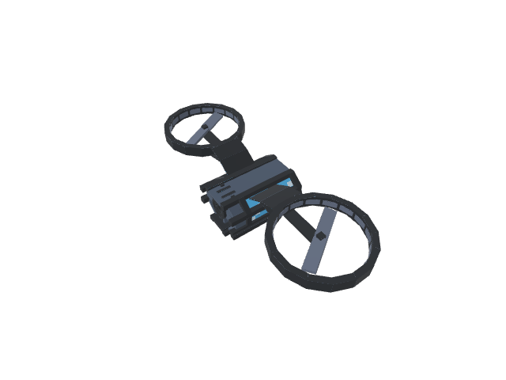

# Lore & Story

## The Backcast Protocol

> "Time is not a river. It is a source code."

In the year 2084, a catastrophic data corruption event known as **The Null Pointer** wiped out 90% of the world's digital infrastructure. Civilization collapsed as financial systems, power grids, and automated logistics networks failed simultaneously.

You are an **Archivist**.

Your job is not to fix the present—it's too late for that. Your mission is to use the **Backcast Protocol**, a quantum-computing interface that allows you to inject code into the past.

## The Drone Swarms

The drones you control are not physical. They are **chrono-packets**—executable agents sent through the timestream to repair the corrupted subroutines that led to The Null Pointer.

  

## Factions

### The Maintainers
A group dedicated to preserving the "original" timeline, believing the corruption is a natural evolution. They will try to block your commits.

### The Refactorers
Radicals who want to rewrite history entirely, not just fix the bugs. They supply you with the illegal **Overclock** modules.

## Your Goal

Reach the **Root Directory**. Find the source of the corruption.
`git reset --hard` the world.
